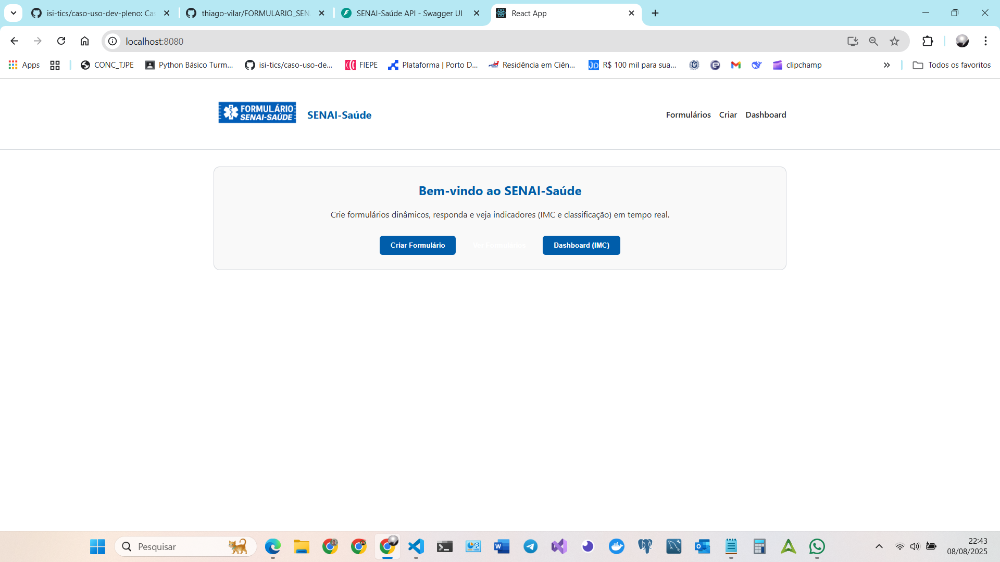
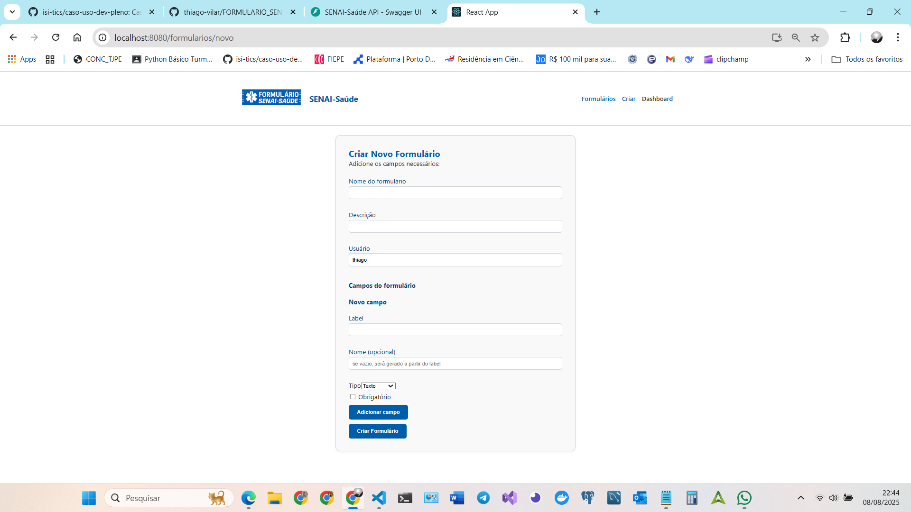
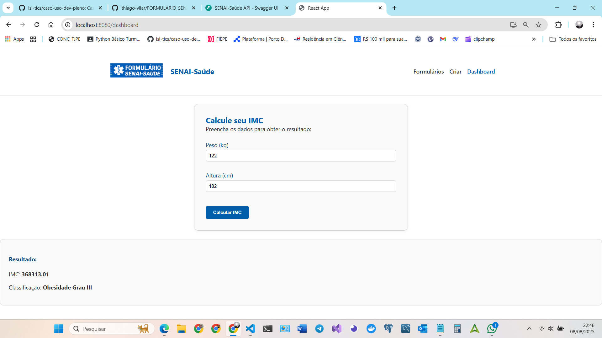

# FORMULARIO_SAUDE-SENAI

Sistema para **gerenciamento e execução de formulários dinâmicos** no contexto do projeto **SENAI-Saúde**, com **backend em FastAPI** e **frontend em React.js**.

---

## 1. Visão Geral
O sistema resolve a necessidade de **formulários flexíveis, versionados e auditáveis** para instituições de saúde, permitindo:
- Criação e atualização de formulários via API, sem alterar código-fonte.
- Versionamento seguro, mantendo histórico.
- Validações robustas.
- Integração simples com qualquer frontend.

**Benefícios:** confiabilidade, escalabilidade e agilidade.

**(imagem)** — Fluxo geral de uso do sistema.

---

## 2. Arquitetura e Padrões
- **MVC adaptado**: Controllers, Services, Models, Schemas.
- **Padrões de projeto**: Singleton, Factory, Observer.
- **Stack**:
  - Backend: Python 3.11+, FastAPI, SQLAlchemy, Alembic, Pydantic, Loguru.
  - Frontend: React.js, Axios.
  - Banco: PostgreSQL 16.
  - Containers: Docker/Docker Compose.

**(imagem)** — Diagrama de arquitetura.

---

## 3. Modelagem
Entidades:
- Formulario
- Campo (inclui calculados)
- Resposta
- Versionamento
- AuditLog

**(imagem)** — Diagrama entidade-relacionamento.

---

## 4. Endpoints Principais
- `POST /formularios` — cria formulário.
- `GET /formularios` — lista formulários.
- `GET /formularios/{id}` — detalha formulário.
- `PUT /formularios/{id}/schema_version` — nova versão.
- `DELETE /formularios/{id}` — soft delete.
- `POST /formularios/{id}/respostas` — envia respostas.
- `GET /formularios/{id}/respostas` — lista respostas.
- `DELETE /formularios/{id}/respostas/{id_resposta}` — remove resposta.


---

## 5. Passo a Passo de Execução

### 5.1 Clonar o repositório
```bash
git clone https://github.com/usuario/FORMULARIO_SAUDE-SENAI.git
cd FORMULARIO_SAUDE-SENAI
```

### 5.2 Backend (local)
```bash
cd backend
python -m venv env
source env/bin/activate   # Linux/Mac
.\env\Scripts\activate    # Windows
pip install -r requirements.txt
alembic upgrade head
uvicorn app.main:app --reload --port 4000
```
Acesse: [http://localhost:4000/docs](http://localhost:4000/docs)

### 5.3 Frontend (local)
```bash
cd ../frontend
npm install
npm start
```
Acesse: [http://localhost:3000](http://localhost:3000)

### 5.4 Docker
```bash
docker compose up -d --build
```
- Frontend: [http://localhost:8080](http://localhost:8080)  
- API: [http://localhost:4000](http://localhost:4000)

---

## 6. Decisões Técnicas
- **FastAPI**: performance e documentação automática.
- **PostgreSQL**: integridade e escalabilidade.
- **React**: interface modular e reativa.
- **Docker**: padronização.

---

## 7. Roadmap
- CRUD de respostas completo.
- Validações avançadas.
- Testes automatizados Pytest.
- Auditoria detalhada.

---

## 8. Exemplo rápido com curl
```bash
curl -X POST http://localhost:4000/formularios \
-H "Content-Type: application/json" \
-d '{
  "nome": "Formulário IMC",
  "descricao": "Calcula índice de massa corporal",
  "campos": []
}'
```

---

## 9. Licença
Conteúdo não disponível no momento.

## 10. Anexos









## 11. Contato

Thiago Cabral Vilar
(81) 99517 1234
oceanocabral@gmail.com
https://github.com/thiago-vilar/FORMULARIO_SENAI-SAUDE